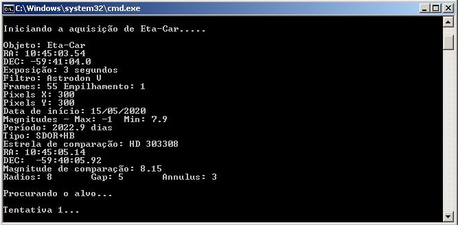
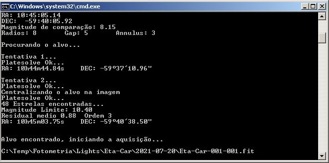
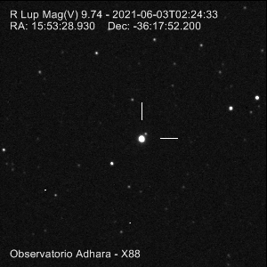
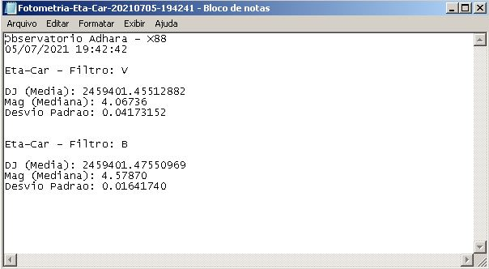
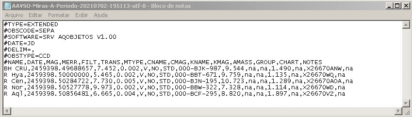

# AQObject

## Contexto
A principal motivação de desenvolvimento desse software foi o fato de passar horas na frente do computador / telescópio sendo na captura na redução dos dados. Essa necessidade se tornou mais crítica quando comecei a participar do projeto de fotometria da estrela Eta Carinae. O astrofísico Augusto Damineli como pesquisador responsável desenvolveu um roteiro de padronização das capturas e indicou que o trabalho de ter um intervalo de 3 a 5 dias e no mínimo 50 imagens por filtro, no meu caso como utilizo B e V são pelo menos 100 imagens a cada 3 dias. 

## Tecnologia usada

Desenvolvimento:
> Projeto foi desenvolvido utilizando VBScript,  plataforma ASCOM e faz interface com o software Maxim. A partir de um arquivo texto contendo a lista de objetos desejados o AQObject gerencia toda a operação de catura, desde a busca, centralização, aquisição, calibração e redução dos dados.

> O resutltado final é apresentado em forma de imagem e/ou arquivo texto em forma sintética, analítica ou padrão AAVSO.

